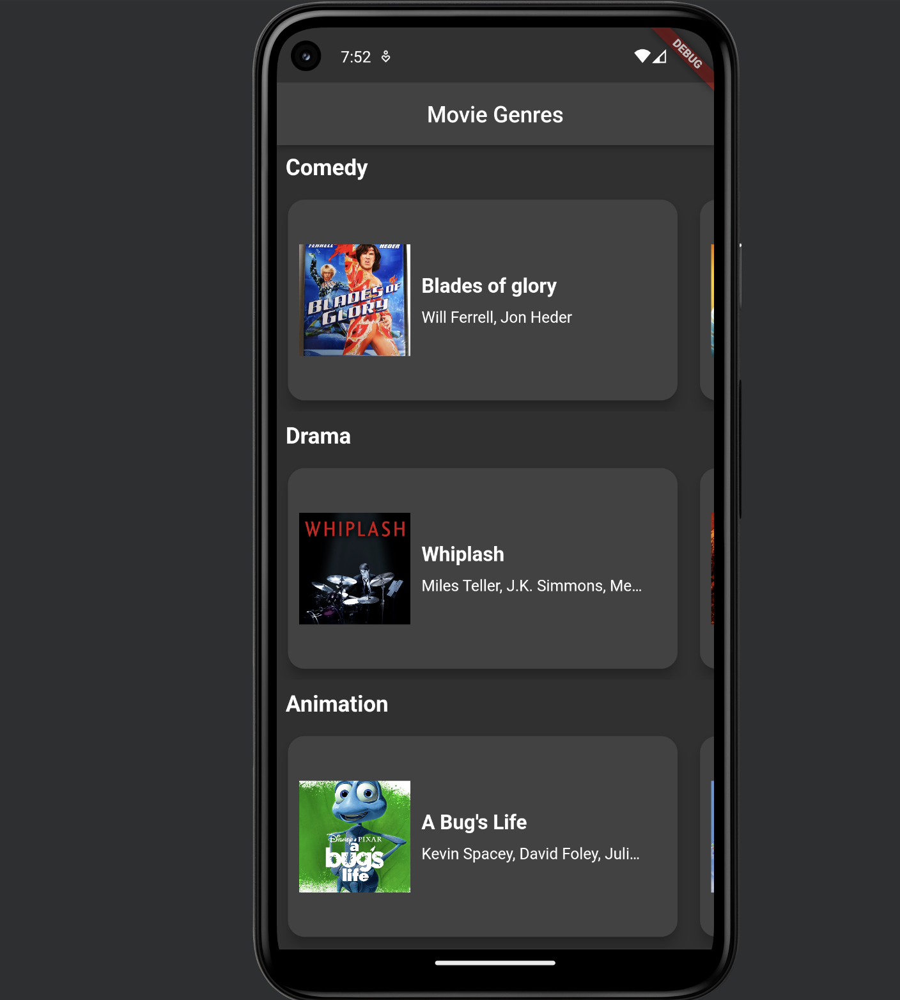
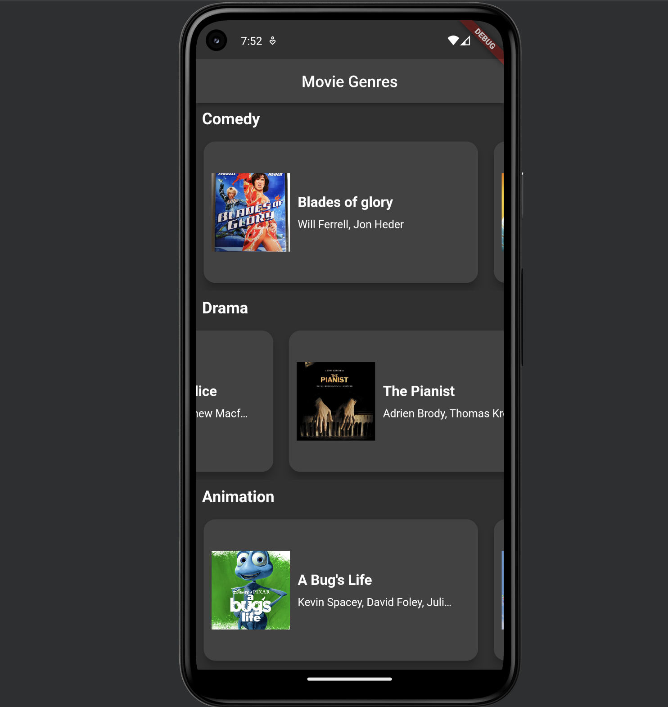
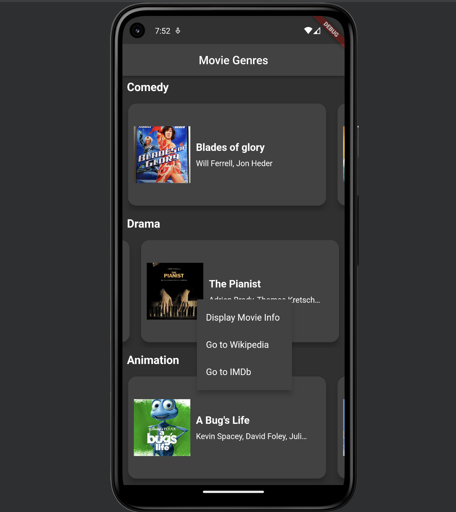
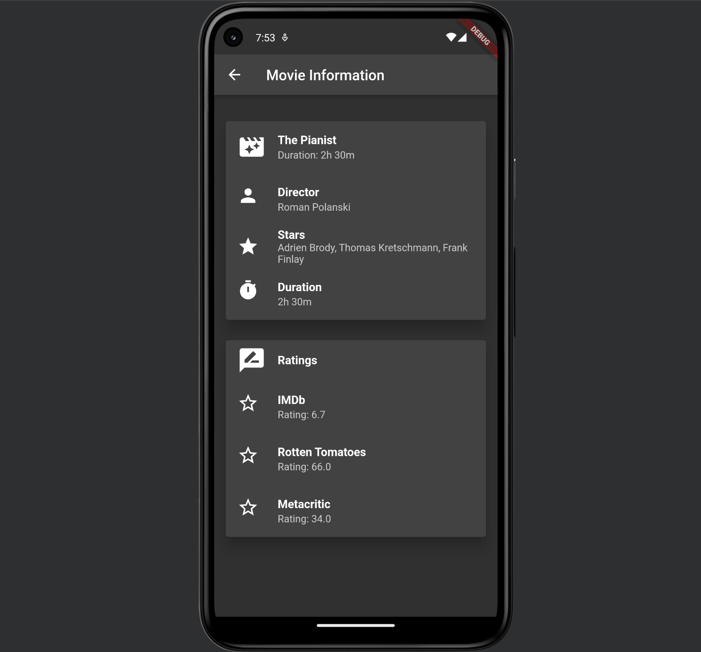
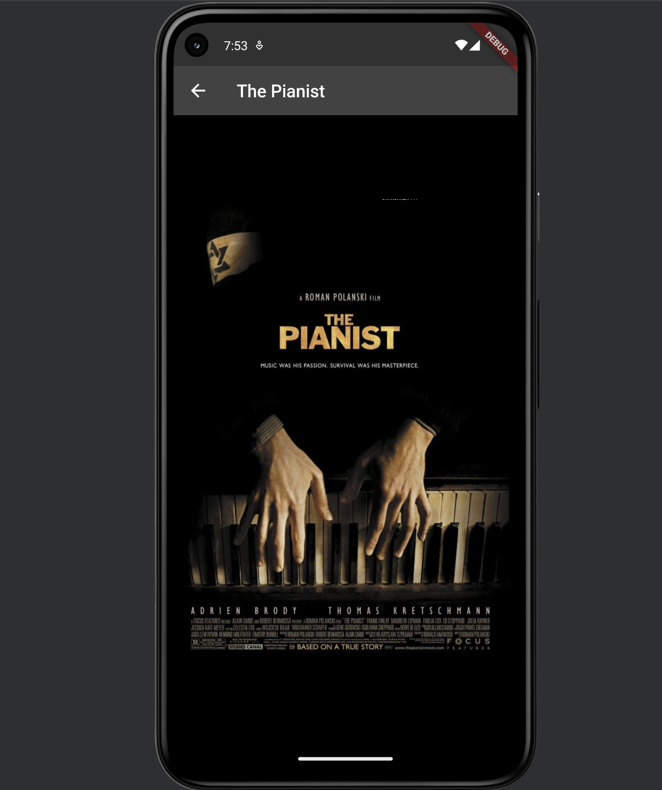

# Flutter Movie Genre App

## Overview
The Flutter Movie Genre App is a mobile application that categorizes movies by genres, displaying them in an engaging, scrollable interface. Users can interact with the app to view detailed information about movies, access related web resources, and more.

## Features
- Displays movies in three horizontal-scrolling lists categorized by genres such as Comedy, Drama, and Animation.
- Each list features a header and allows users to scroll through movie entries that display a thumbnail and brief movie details.
- Interactive movie listings respond to taps and long presses, bringing up detailed views or web resources related to the movie.

## Usage

*Note: The full Android Studio project is not included due to size constraints. You must use the provided files and import the code into your own Flutter project to run the app.*

- **Navigating the App:** Start by exploring the genre-specific lists on the main screen. Scroll horizontally to see more movies in each category.
- **Interacting with Movies:**
  - **Short Tap:** Opens a new screen displaying the movie's poster in full view. Tapping on the poster navigates to the movie's IMDb page.
  - **Long Press:** Displays a pop-up menu with options to view detailed movie information, visit the movie's Wikipedia page, or view its IMDb page.
- **Returning to Previous Screens:** Use the back button in the toolbar to navigate back to the main list from any detailed view.

## Included Files
- **Dart Classes:**
  - `main.dart`: Initializes and runs the app.
  - `movie.dart`: Defines the Movie data model.
  - `movie_card.dart`: Widget for displaying individual movie entries.
  - `movie_data.dart`: Includes hardcoded data for various movies.
  - `movie_genres_screen.dart`: Main screen that displays movies by genre.
  - `movie_info_screen.dart`: Displays detailed information about a movie.
  - `movie_poster_screen.dart`: Shows a full-screen view of a movie poster.
  - Images used inside 'images' folder.
  - Sample images of app usage.

## App Screens
- **Movie Genres Screen:** The primary screen with movie genre categories.
  
  
- **Movie Genres Screen (Sliding):** Displays the movies in a genre as you scroll horizontally.
  
  
- **Movie Genres Screen (Displaying Options):** Shows the options available when long-pressing on a movie.
  
  
- **Movie Information Screen:** Provides detailed information about the selected movie.
  
  
- **Movie Poster Screen:** Displays a full-screen view of the movie poster.
  

## Design and Navigation
- The app features a clean, intuitive interface with smooth transitions between screens.
- All screens contain a toolbar for easy navigation and a consistent look-and-feel across the app.

